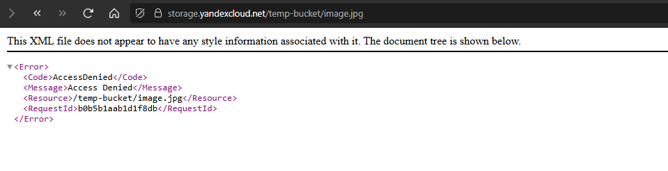
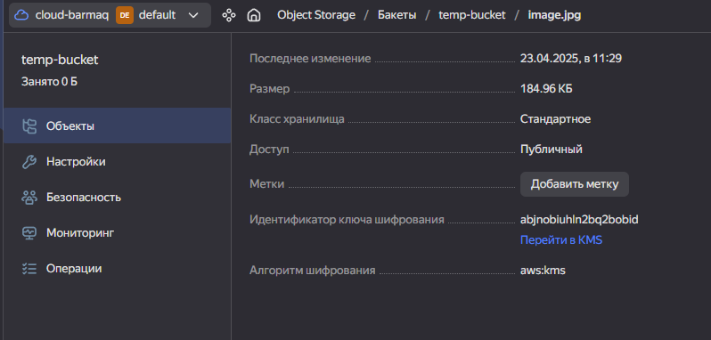
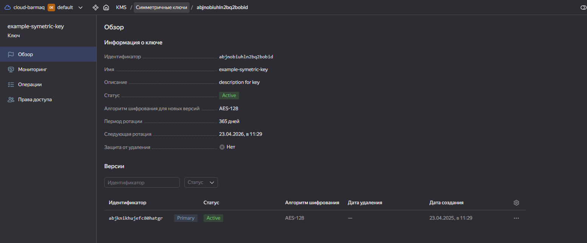

# Домашнее задание к занятию «Безопасность в облачных провайдерах»  

Используя конфигурации, выполненные в рамках предыдущих домашних заданий, нужно добавить возможность шифрования бакета.

---
## Задание 1. Yandex Cloud   

1. С помощью ключа в KMS необходимо зашифровать содержимое бакета:

 - создать ключ в KMS;
 - с помощью ключа зашифровать содержимое бакета, созданного ранее.

файл terraform  

[s3.tf](./files/s3.tf)  

пытаемся получить доступ к выложенному изображению напрямую  

  

смотрим параметры бакета, видим что он зашифрован ключем  с id abjnobiuhln2bq2bobid 

  

смотрим параметры ключа abjnobiuhln2bq2bobid  

  

2. (Выполняется не в Terraform)* Создать статический сайт в Object Storage c собственным публичным адресом и сделать доступным по HTTPS:

на данный момент нет своего доменного имени. приобрету позже и сделаю самостоятельно. но смысл понятен - ссл сертификаты очень частый кейс в администрировании. есть опыт автоматизации.

p.s. отдельное спасибо методисту за справочную информацию. очень помогает.

Полезные документы:

- [Настройка HTTPS статичного сайта](https://cloud.yandex.ru/docs/storage/operations/hosting/certificate).
- [Object Storage bucket](https://registry.terraform.io/providers/yandex-cloud/yandex/latest/docs/resources/storage_bucket).
- [KMS key](https://registry.terraform.io/providers/yandex-cloud/yandex/latest/docs/resources/kms_symmetric_key).

