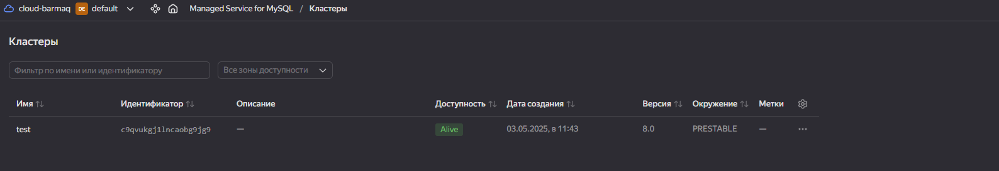
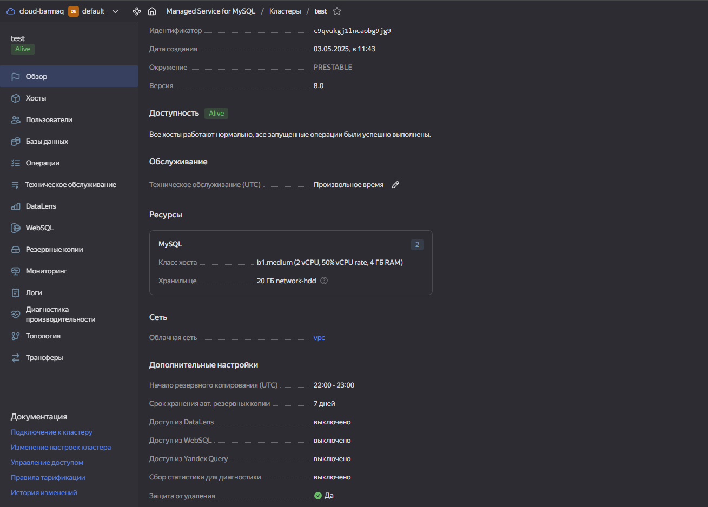
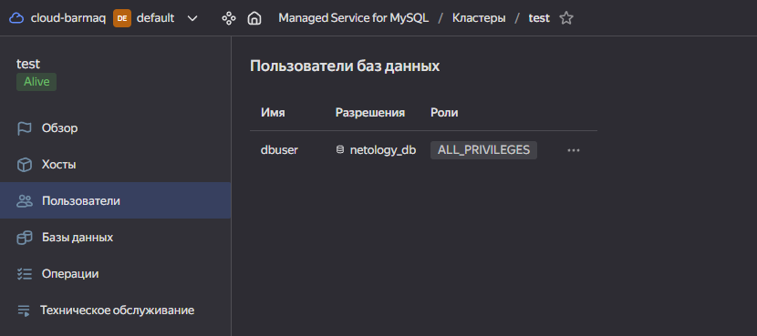
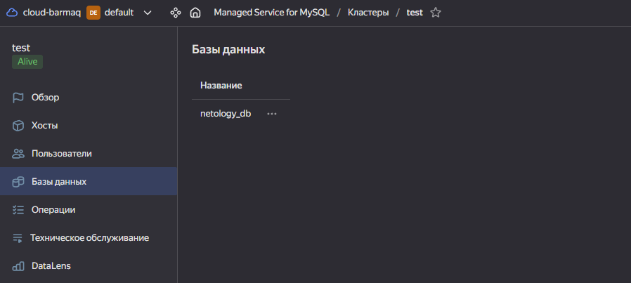
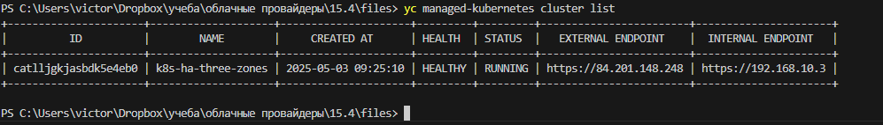
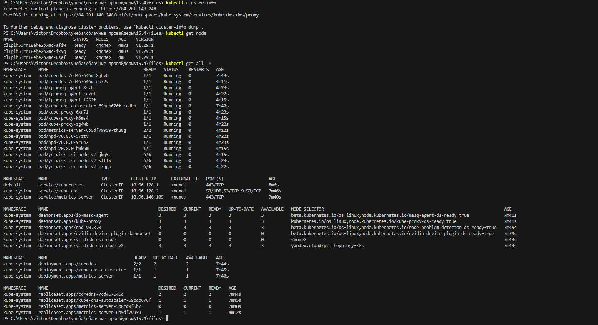
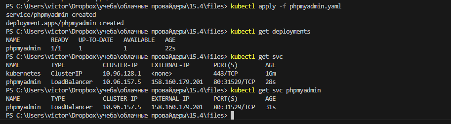
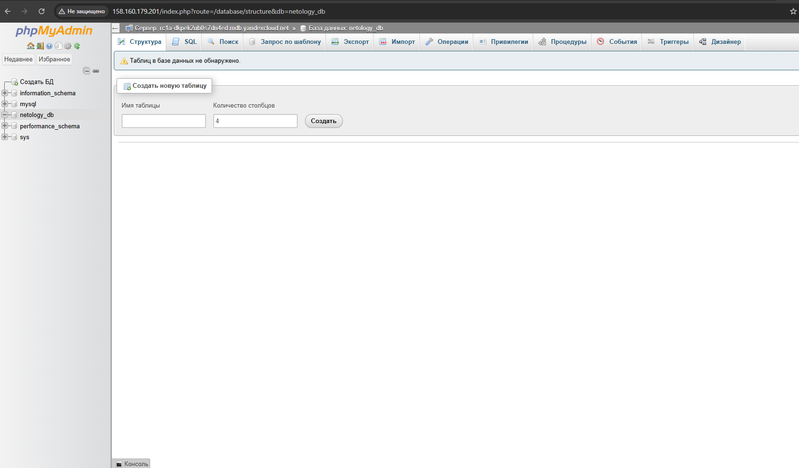

# Домашнее задание к занятию «Кластеры. Ресурсы под управлением облачных провайдеров»

### Цели задания 

1. Организация кластера Kubernetes и кластера баз данных MySQL в отказоустойчивой архитектуре.
2. Размещение в private подсетях кластера БД, а в public — кластера Kubernetes.

---
## Задание 1. Yandex Cloud

1. Настроить с помощью Terraform кластер баз данных MySQL.

 - Используя настройки VPC из предыдущих домашних заданий, добавить дополнительно подсеть private в разных зонах, чтобы обеспечить отказоустойчивость. 
 - Разместить ноды кластера MySQL в разных подсетях.
 - Необходимо предусмотреть репликацию с произвольным временем технического обслуживания.
 - Использовать окружение Prestable, платформу Intel Broadwell с производительностью 50% CPU и размером диска 20 Гб.
 - Задать время начала резервного копирования — 23:59.
 - Включить защиту кластера от непреднамеренного удаления.
 - Создать БД с именем `netology_db`, логином и паролем.


## Задание 1. решение


- создаем mysql кластер и ресурсы  

создал 1 vpc, 2 зоны private  
[манифест main.tf](./files/main.tf)  

создал манифест кластера mysql  
[манифест mysql.tf](./files/mysql.tf)  
и переменные для него  
[var для mysql.tf](./files/variables-mysql.tf)  

в рамках манифеста задал :  
произвольное время обслуживания используя ключ ( по дефолту он и работает ) :  
```
maintenance_window  
```

задал время начала резервного копирования через ключ : 
```
backup_window_start  
```

включил защиту от удаления ( закомментированно в манифесте для корректного удаления реурсов) используя ключ  
```
deletion_protection  
``` 

создал бд `netology_db` и пользователя с паролем 

- итоги :  

кластер Mysql 
  

подробности ( включая защиту от удаления )  
  

пользователь  
  

БД `netology_db`  
  


2. Настроить с помощью Terraform кластер Kubernetes.

 - Используя настройки VPC из предыдущих домашних заданий, добавить дополнительно две подсети public в разных зонах, чтобы обеспечить отказоустойчивость.
 - Создать отдельный сервис-аккаунт с необходимыми правами. 
 - Создать региональный мастер Kubernetes с размещением нод в трёх разных подсетях.
 - Добавить возможность шифрования ключом из KMS, созданным в предыдущем домашнем задании.
 - Создать группу узлов, состояющую из трёх машин с автомасштабированием до шести.
 - Подключиться к кластеру с помощью `kubectl`.
 - *Запустить микросервис phpmyadmin и подключиться к ранее созданной БД.
 - *Создать сервис-типы Load Balancer и подключиться к phpmyadmin. Предоставить скриншот с публичным адресом и подключением к БД.


- создаем кластер k8s  

создал манифест кластера k8s   
[манифест mysql.tf](./files/k8s.tf)  
и переменные для него 
[var для mysql.tf](./files/variables-k8s.tf)  


в рмках манифестов :  
переписал переменные подсетей на map (object) чтобы не путаться в куче переменных. можно создавать подсети через for each или count , но тут решил задавтаь напрямую, для полного контроля  
[манифест main.tf](./files/main.tf)  

создал отдельный сервис-аккаунт с необходимыми правами используя resource "yandex_iam_service_account"  

создал региональный мастер Kubernetes с размещением нод в трёх разных подсетях используя resource "yandex_kubernetes_cluster"  

создал kms  ключ используя  resource "yandex_kms_symmetric_key"  

Создать группу узлов, состояющую из трёх машин с автомасштабированием до шести используя yandex_kubernetes_node_group  


-------

- Подключиться к кластеру с помощью kubectl.  
подключаемся и проверяем ресурсы  


```
yc managed-kubernetes cluster list  
yc managed-kubernetes cluster get-credentials <id> --external  
```
 

```
kubectl cluster-info   
kubectl get node  
kubectl get all -A  
```
 


- *Запустить микросервис phpmyadmin и подключиться к ранее созданной БД.  *Создать сервис-типы Load Balancer и подключиться к phpmyadmin.  

создаем yaml манифест
[phpmyadmin.yaml](./files/phpmyadmin.yaml) 

применяем и проверяем ресурсы 

```
kubectl apply -f phpmyadmin.yaml
kubectl get deployments
kubectl get svc
```
 

заходим в phpmyadmin 
 


-------------------


Полезные документы:

- [MySQL cluster](https://registry.terraform.io/providers/yandex-cloud/yandex/latest/docs/resources/mdb_mysql_cluster).
- [Создание кластера Kubernetes](https://cloud.yandex.ru/docs/managed-kubernetes/operations/kubernetes-cluster/kubernetes-cluster-create)
- [K8S Cluster](https://registry.terraform.io/providers/yandex-cloud/yandex/latest/docs/resources/kubernetes_cluster).
- [K8S node group](https://registry.terraform.io/providers/yandex-cloud/yandex/latest/docs/resources/kubernetes_node_group).

